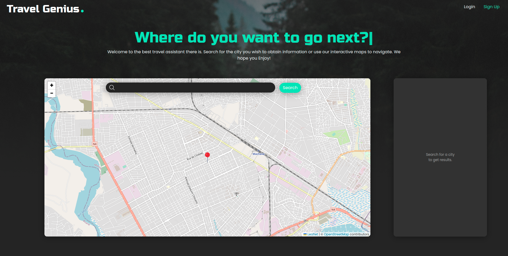
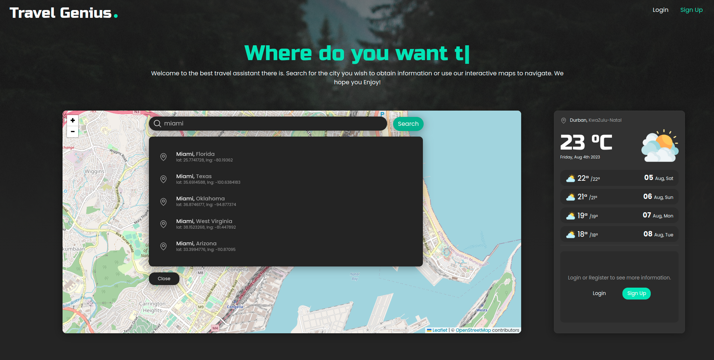
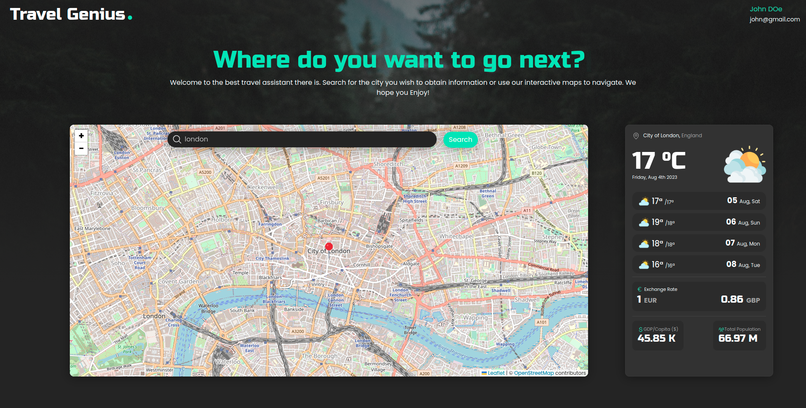
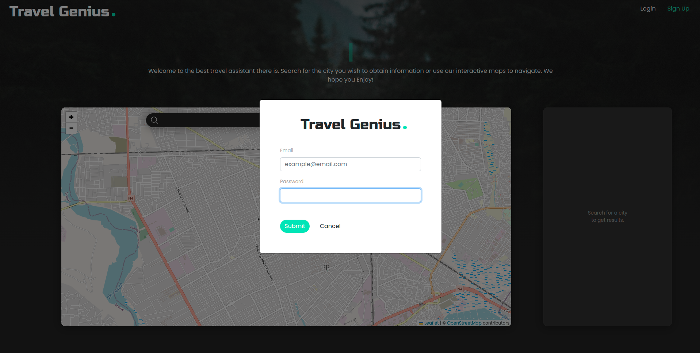
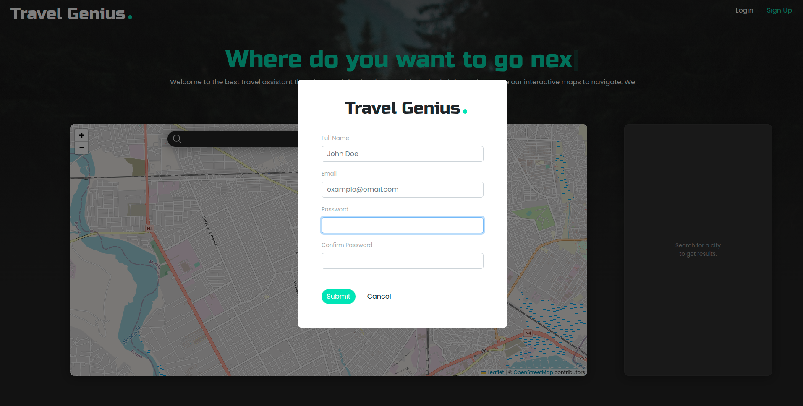

# Travel Assistant 
<center></center>  
This project is a travel assistant web-app that allows users to simply search for a destination city and get some information about the location. The following information is provided:     
* Country's current population and GDP per capita;
* The weather forecast for that city, and;
* The exchange rate for the country local currency;

This project is composed by a **FrontEnd** and **Backend** service.
## Screenshots
<center> </center>
<center> </center>
<center> </center>
<center> </center>
<center> </center>


## Tech Stack

**Client:** React, Bootstrap

**Server:** Node, Express


## API Reference

#### Register

```http
  POST /api/auth/register
```

| Body | Type     | Description                |
| :-------- | :------- | :------------------------- |
| `name` | `string` | **Required**. |
| `email` | `string` | **Required**. |
| `password` | `string` | **Required**.  |

#### Login

```http
  POST /api/auth/login
```

| Body | Type     | Description                       |
| :-------- | :------- | :-------------------------------- |
| `email`      | `string` | **Required**.  |
| `password`      | `string` | **Required**. |

#### Get City Information (Forecast, exchange rate, gdp per capita, population)

```http
  GET /api/services/travelinfo?lat=&lon=
```

| Parameter | Type     | Description                       |
| :-------- | :------- | :-------------------------------- |
| `lat`      | `number` | **Required**.  The latitude of the location|
| `lon`      | `string` | **Required**. The longitude of the location|

#### Get Cities by search keyword term

```http
  GET /api/services/cities?q=
```

| Parameter | Type     | Description                       |
| :-------- | :------- | :-------------------------------- |
| `q`      | `string` | **Required**.  City keyword search term|


## Backend
### Prerequesites
To install the project, make sure to have `node` installed (v12 or later) & `npm` installed.  These commands were run on Ubuntu 20.04 LTS. You can also use windows command prompt or the WSL terminal. To install the tools, run the following command:
```sh
sudo apt install node
```
```sh
sudo apt install npm
```
You can verify the installed version by running the following commands:
```sh
npm -v
node -v
```
### Installation
Navigate to the project root directory (`/server`) and run the following command:
```sh
npm install
```
This will install all the necessary dependencies to run the project.

### Running the project
To run this project, you will need to add the following environment variables to your .env file:    
`PORT`    
`OPENWEATHER_API_KEY`        
`EXCHANGERATES_API_KEY`    
`JWT_SECRET`    
Check the `.env.example` file for reference.  

To run the project, execute the command in the project root directory :
```sh
npm start
```
To run in **development** mode, execute the following command:
```sh
npm run dev
```
To run **test**, execute the following command:
```sh
npm run test
```
## FrontEnd
### Prerequesites
To install the project, make sure to have `node` installed (v12 or later) & `npm` installed.  These commands were run on Ubuntu 20.04 LTS. You can also use windows command prompt or the WSL terminal. To install the tools, run the following command:
```sh
sudo apt install node
```
```sh
sudo apt install npm
```
You can verify the installed version by running the following commands:
```sh
npm -v
node -v
```
### Installation
Navigate to the project root directory (`/client`) and run the following command:
```sh
npm install
```
This will install all the necessary dependencies to run the project.

### Running the project
To run this project, you will need to add the following environment variables to your .env file:    
`REACT_APP_API_URL`    
Check the `.env.example` file for reference. 

To run in **development** mode, execute the following command in the project root directory (`/client`):
```sh
npm start
```
To create a **production** build  , execute the following command:
```sh
npm run build
```
## Contributing

Contributions are what makes the open-source community such an amazing place to learn, inspire, and create. Any contributions you make are **greatly appreciated**.

If you have a suggestion that would make this better, please fork the repo and create a pull request. You can also simply open an issue with the tag "enhancement".
Don't forget to give the project a star! Thanks again!

1. Fork the Project
1. Create your Feature Branch (`git checkout -b feature/AmazingFeature`)
3. Commit your changes (`git commit -m 'Add some AmazingFeature'`)
4. Push to the Branch (`git push origin feature/AmazingFeature`)
5. Open a Pull Request

## License

Distributed under the [MIT](https://choosealicense.com/licenses/mit/) License. 
